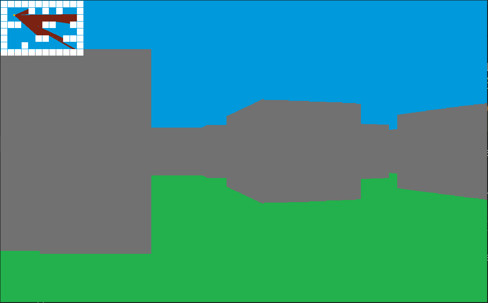

# ALX SE End of the fondation project: Default Maze project

This project is aim to be the end of the fondation in the ALX SE training.
## What you will be discovered in t
1. [Requirements](#Requirements)
2. [Installation](#Installation)
3. [Compilation](#Compilation)
4. [Use](#Use)
## Requirements
The run this project and get a overview of my maze project. You need first to have ``SDL2`` install in your computer, you will need also ``gcc`` and ``make`` to make the compilation of the project more easy.
## Installation
On linux you can install ``gcc`` by `sudo apt-get install build-essential` after that we need to install `sdl2` by following this guide [Install SDL2 on linux](https://lazyfoo.net/tutorials/SDL/01_hello_SDL/linux/index.php). And finally we need to have `make` install on linux `sudo apt install make`.
## Comiplation
To compile this project we need to use gcc and also link the sdl lib to our project. To make the things easy we have create a [Makefile](./README.md) to avoid running the command by ourself.
On this file we have a target ``all`` allow us to build all our `*.c` files to `.o` files.
****
After that we need to run the [prog](./prog) file to see the render of our project.

## Use
To move the player you just need to press to the key `w` or `s` and also use `a` or `d` to change the direction.

https://github.com/Soulsaw/portfolio/assets/87091389/989c1f73-ab66-46bd-89aa-376e408a64e7

